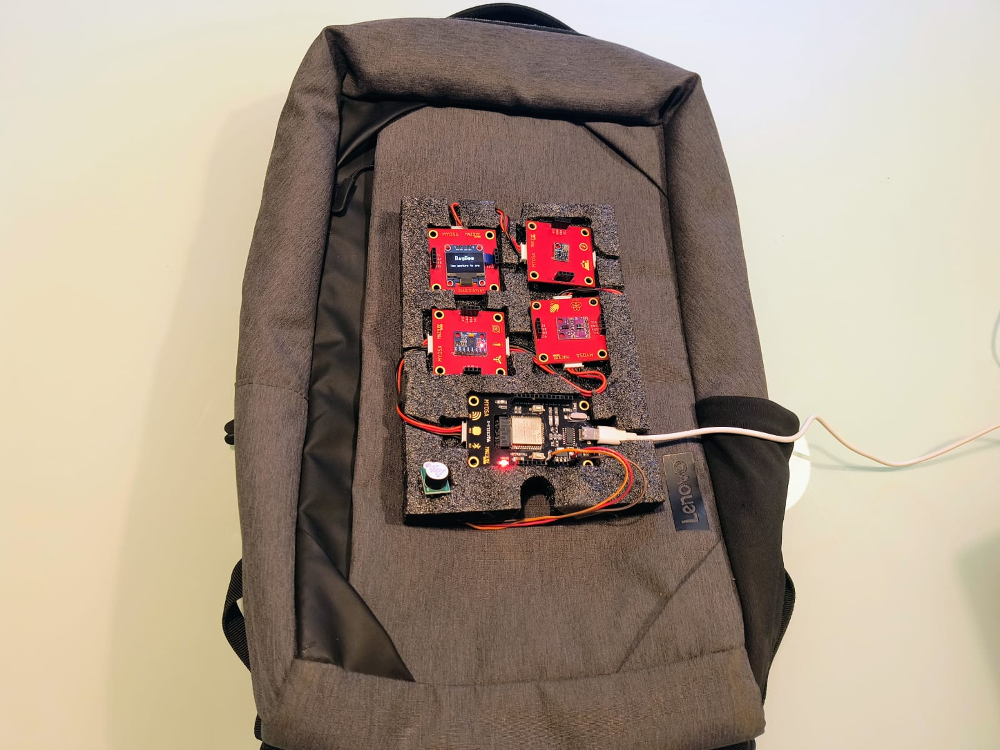
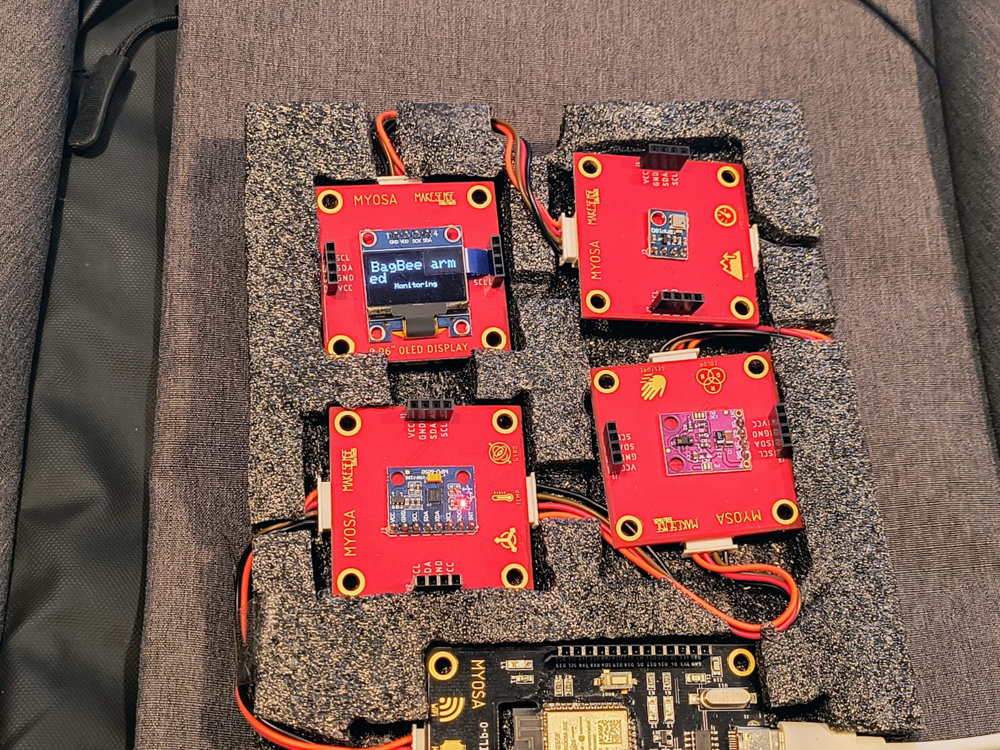
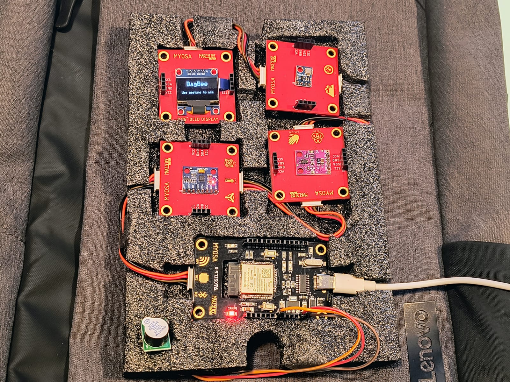
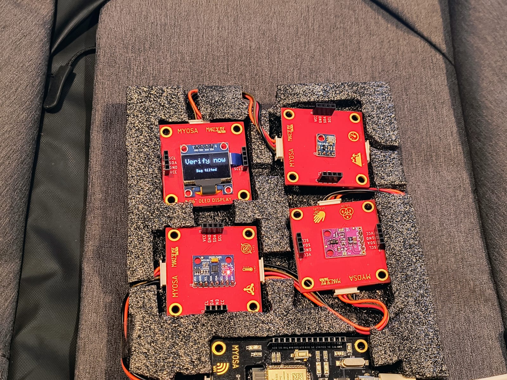
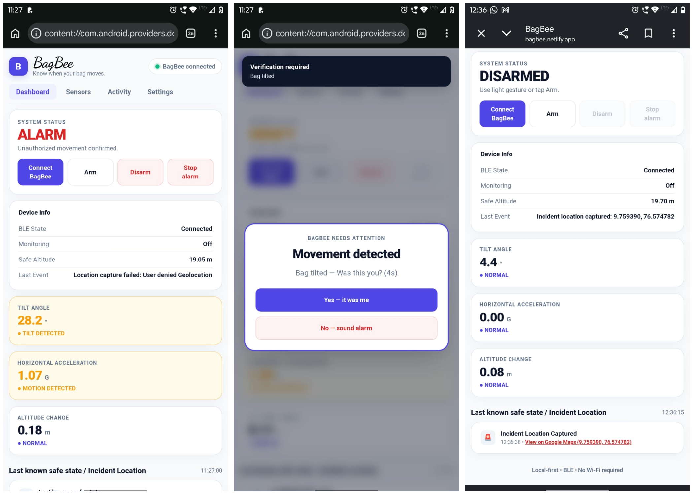

---

publishDate: 2026-08-23
title: BagBee - A Touchless, Verified-Alert Security Node for Unattended Luggage on Long-Distance Train Journeys
excerpt: BagBee is a portable luggage-security system that combines touchless gesture authentication, motion analysis, silent BLE alerts, and staged alarm escalation to provide a verified approach to luggage security.
image: bagbee-cover.jpg
tags:

* IoT
* ESP32
* Security

---

> **Don't just detect movement. Verify it.**

---

## Acknowledgements

We would like to thank the **MYOSA team** for providing the Mini IoT Kit and the platform that made it possible to prototype and demonstrate this project.

We also thank our faculty mentor and institution for their guidance and support throughout the development of BagBee.

---

## Overview

### The Problem

Long-distance train journeys, particularly sleeper-class travel, often require passengers to leave their luggage unattended while resting or sleeping. This creates a familiar concern: the possibility of luggage being moved or taken while the owner is unaware.

Conventional approaches such as chains, padlocks, and simple motion alarms provide limited protection. Mechanical solutions may only delay unauthorized movement, while simple motion alarms can respond to ordinary train vibrations and other environmental disturbances.

BagBee approaches this problem differently.

Instead of treating every movement as a theft event, BagBee is designed as a **verified-alert security pipeline**. It combines touchless arming, continuous motion monitoring, local filtering, silent notification, owner verification, and staged alarm escalation.

### What BagBee Does

BagBee is a compact security node designed to remain inside or with unattended luggage during travel.

The system uses the **ESP32** as its central controller and combines:

* **APDS9960** for touchless gesture-based arming and disarming
* **MPU6050** for continuous motion and spatial monitoring
* **SSD1306 OLED** for setup and local status feedback
* **ESP32 BLE** for silent notification to the owner's smartphone
* **Piezo buzzer** for final audible alarm escalation

The core decision-making and filtering are intended to run locally on the ESP32, without depending on cloud connectivity or mobile data.

### Who It Is For

BagBee is primarily intended for passengers travelling with luggage on long-distance train journeys, especially situations where luggage must remain unattended while the passenger is resting.

The concept can also serve as a foundation for portable, battery-powered personal and asset-security applications.

### How It Works

The system follows a layered sequence:

```text
Gesture-Based Arming
        ↓
Motion Baseline Established
        ↓
Continuous Motion Monitoring
        ↓
Suspicious Movement Detected
        ↓
Silent BLE Pre-Alert
        ↓
Owner Verification Window
        ↓
 ┌───────────────┬────────────────┐
 │ Owner Confirms│ No Response    │
 │               │                │
 ↓               ↓                │
Silent Disarm    Alarm Escalation │
```

This approach shifts the focus from simply producing a loud alarm to **detecting, communicating, verifying, and escalating** a potential security event.

### Key Features

* Touchless multi-step gesture authentication
* Continuous IMU-based motion monitoring
* Filtering intended to distinguish train vibration from suspicious movement
* Silent BLE pre-alert before audible escalation
* Owner verification window
* Multi-stage alarm escalation
* Separate tamper-distinct alarm path
* Local edge processing without cloud dependency

---

## Demo / Examples

### Images

All project images are placed in the same folder as this Markdown file.

#### BagBee Prototype

<p align="center">
<br/>
<i>BagBee - Touchless, verified-alert luggage security system</i>
</p>

#### Prototype Setup

<p align="center">
<br/>
<i>BagBee prototype and MYOSA Mini IoT Kit setup</i>
</p>

#### Gesture-Based Arming

<p align="center">
<br/>
<i>Touchless gesture sequence used for arming and disarming</i>
</p>

#### BLE Alert

<p align="center">
<br/>
<i>Silent pre-alert delivered to the owner's smartphone</i>
</p>

#### Alarm Escalation

<p align="center">
<br/>
<i>Final alarm escalation after the verification window expires</i>
</p>

### Videos

The project demonstration is provided as a local MP4 file.

The demonstration follows four stages:

1. Arming the system using the correct gesture sequence
2. Demonstrating immunity to simulated train vibration
3. Simulating suspicious luggage movement and showing the BLE pre-alert
4. Allowing the verification window to expire and demonstrating alarm escalation

<video controls width="100%">
<source src="./bagbee-demo.mp4" type="video/mp4">
</video>

---

## Features (Detailed)

### 1. Gesture-PIN Arm and Disarm

BagBee uses the **APDS9960 Gesture & Proximity Sensor** as a touchless security interface.

Rather than relying on a single gesture, the system is designed to recognize a specific ordered sequence of gestures. This sequence acts as a security PIN for arming and disarming.

This provides a touchless interaction while reducing the possibility of casual or accidental disarming.

During setup, the OLED provides visual feedback to the user. Once armed, the OLED can be powered down for stealth operation.

---

### 2. Continuous Motion Monitoring

The **MPU6050 IMU** continuously monitors the spatial behaviour of the luggage.

When the system is armed, it establishes a motion baseline and observes subsequent changes in the monitored X/Y/Z movement.

The purpose is not simply to detect that the luggage moved, but to evaluate the nature of that movement before escalating the event.

---

### 3. Train-Vibration Filtering

A major challenge in luggage security during train travel is distinguishing genuine suspicious movement from normal environmental vibration.

BagBee is designed with adaptive low-pass filtering to differentiate between:

* High-frequency, low-amplitude vibration associated with normal train movement
* Sustained, lower-frequency horizontal movement associated with dragging or lifting

This filtering takes place locally on the ESP32 so that the system can make its security decision without depending on cloud processing.

---

### 4. Silent BLE Pre-Alert

When suspicious movement crosses the defined detection condition, BagBee uses the ESP32's **Bluetooth Low Energy capability** to send a silent notification to the owner's smartphone.

The audible alarm is intentionally delayed at this stage.

This provides the owner with an opportunity to verify the event before the system escalates.

The silent-first approach also addresses a limitation of a conventional alarm-only system: a loud alarm may be noticed only after the event has already progressed.

---

### 5. Verification Window

After the silent pre-alert, the owner is given a short verification window.

The phone presents a simple confirmation interaction equivalent to:

> **Was this you?**

If the owner confirms that the movement was intentional, the system can be silently disarmed.

If there is no response during the verification window, BagBee proceeds to the final escalation stage.

This creates a clear distinction between:

**Suspicious movement detected**

and

**Unverified suspicious movement.**

---

### 6. Multi-Stage Alarm Escalation

If the owner does not confirm the event within the verification window, BagBee escalates the response.

The final stage activates the **piezo buzzer** and provides a local warning indication through the OLED.

The resulting security pipeline is:

```text
Detection
   ↓
Silent Notification
   ↓
Owner Verification
   ↓
No Confirmation
   ↓
Audible Alarm
```

This staged response is central to BagBee's design.

---

### 7. Tamper-Distinct Alarm Path

BagBee also provides a separate security path for attempts to interfere with the security node itself while the system is armed.

An unauthorized attempt to open or remove the node without the correct disarm gesture can trigger immediate escalation independently of the normal luggage-drift detection path.

This prevents the primary motion-detection logic from being the only line of defence.

---

### 8. Edge-Based Processing

The **ESP32** acts as the central state-machine controller.

The intended processing flow includes:

* Reading sensor data
* Monitoring motion
* Processing gesture input
* Applying filtering
* Managing security states
* Controlling the OLED
* Handling BLE communication
* Managing alarm escalation

The system is designed to perform its core filtering and decision logic locally, without requiring cloud connectivity or mobile data.

---

## Usage Instructions

### Step 1 - Set Up BagBee

Place the BagBee security node with the luggage in a position where the motion of the luggage can be monitored effectively.

Ensure that the system has sufficient battery power before operation.

### Step 2 - Arm the System

Perform the configured multi-step gesture sequence using the APDS9960 gesture sensor.

The OLED provides setup and arming feedback.

After successful arming, the system enters its monitoring state and the display can be powered down for stealth operation.

### Step 3 - Leave the Luggage Unattended

Once armed, BagBee continuously monitors the luggage using the MPU6050 IMU.

Normal train vibration should be filtered as environmental movement rather than immediately producing an alarm.

### Step 4 - Suspicious Movement

If the monitored movement satisfies the suspicious-movement condition, BagBee sends a silent BLE pre-alert to the owner's smartphone.

### Step 5 - Verify the Alert

The owner can respond during the verification window.

If the movement was intentional, the system can be silently disarmed.

If there is no response, BagBee proceeds to the escalation stage.

### Step 6 - Alarm Escalation

After the verification window expires without confirmation, the piezo buzzer is activated and the local warning indication is displayed.

### Step 7 - Disarm

To intentionally disarm the system, use the configured gesture sequence.

---

## Tech Stack

### Controller

* **ESP32**

  * Central state-machine controller
  * Local processing
  * Bluetooth Low Energy communication

### Sensors

* **APDS9960 Gesture & Proximity Sensor**

  * Touchless security input
  * Gesture-based arming/disarming

* **MPU6050 IMU**

  * Continuous spatial monitoring
  * Motion and drift detection

### Display

* **SSD1306 OLED**

  * Arming countdown
  * Battery/status feedback
  * Local warning indication

### Actuator

* **Piezo Buzzer**

  * Final audible alarm stage

### Software

* **C++**
* **Arduino / ESP32 Framework**

### Power

* **3.7V LiPo Cell**
* **Basic charging and protection circuit**

---

## Requirements / Installation

### Hardware Requirements

The BagBee prototype requires:

* MYOSA Mini IoT Kit
* ESP32 core
* APDS9960 Gesture & Proximity Sensor
* MPU6050 IMU
* SSD1306 OLED
* Piezo buzzer
* 3.7V LiPo cell
* Basic charging and protection circuit
* Smartphone capable of receiving the BLE notification

### Software Requirements

The project software is developed in **C++ using the Arduino/ESP32 framework**.

The ESP32 must be configured with the required project firmware before operation.

### Installation

1. Assemble the MYOSA hardware and additional buzzer/power circuitry.
2. Connect the required sensors and OLED to the ESP32-based MYOSA platform.
3. Prepare the ESP32 development environment with Arduino/ESP32 support.
4. Load the BagBee firmware onto the ESP32.
5. Configure the gesture sequence and security parameters used by the implementation.
6. Power the system and verify the sensor, display, gesture, BLE, and alarm functions.
7. Perform the arming procedure before placing the luggage into unattended operation.

---

## File Structure

```text
/BagBee
├── bagbee.md
├── bagbee-cover.jpg
├── prototype.jpg
├── gesture-arming.jpg
├── ble-alert.jpg
├── alarm-demo.jpg
├── bagbee-demo.mp4
└── src/
    └── bagbee.ino
```

All image and video files used by this Markdown submission are placed in the same folder as `bagbee.md`, as required by the MYOSA submission guidelines.

---

## License

This project is released under the **MIT License**.

See the `LICENSE` file in this repository for the complete license text.

---

## Contribution Notes

BagBee is developed as a MYOSA Event 6.0 project and is intended to demonstrate the use of the MYOSA Mini IoT Kit for a real-world, edge-based security application.

Contributions, suggestions, and improvements are welcome, provided that they respect the originality and open-source ethics of the project.

---

## Project Team

**Arjun S Nair**
3rd Year, B.Tech EEE
College of Engineering Trivandrum

**Nivin Ajith**
3rd Year, B.Tech EEE
College of Engineering Trivandrum

**A Adithya**
3rd Year, B.Tech EEE
College of Engineering Trivandrum

### Faculty Mentor

**Dr. Lekshmi Mohan**
Department of Electrical and Electronics Engineering
College of Engineering Trivandrum

---

## MYOSA Event 6.0

**BagBee** is developed for **MYOSA Event 6.0 - IEEE SENSORS 2026**.

The project demonstrates how the MYOSA Mini IoT Kit can be used as a complete edge-sensing platform for a portable, battery-powered personal security application.

> **BagBee — Detect. Verify. Protect.**
